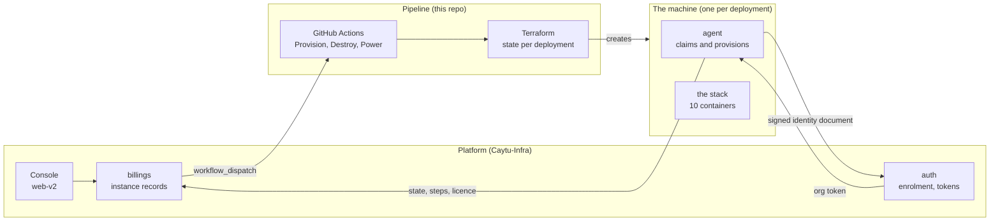
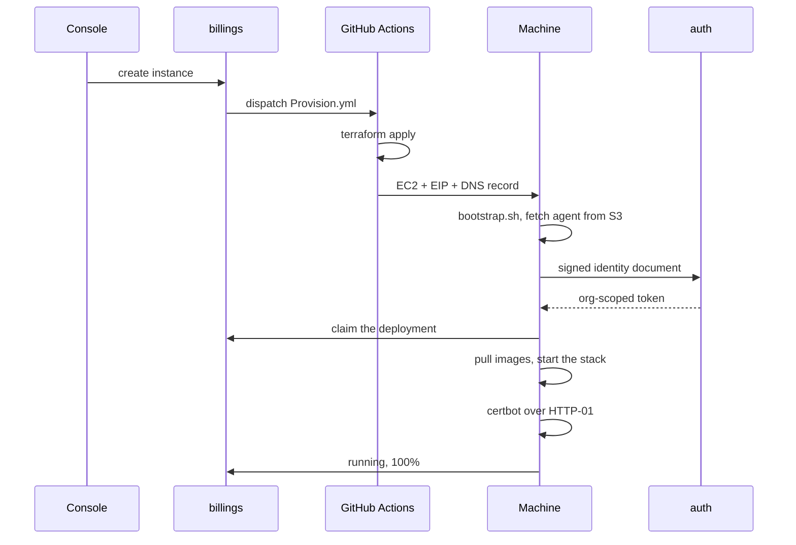
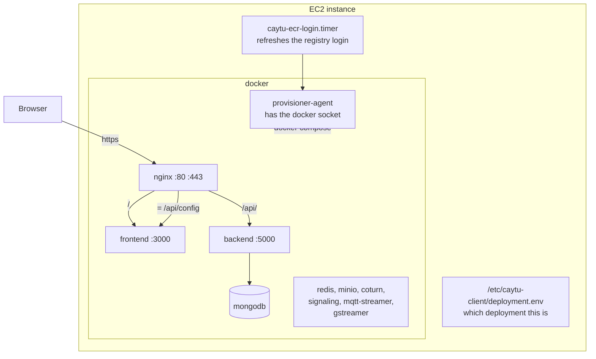
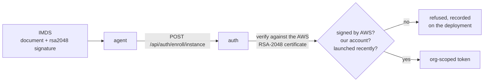

# Architecture

What the pieces are, where they run, and who talks to whom.

## The three sides

The platform never touches a customer machine. It asks a pipeline to build one,
and the machine reports back. That is the whole shape.

The platform holds no AWS credential. It starts a named workflow with fixed
inputs, and that workflow already has the credentials every other pipeline uses.
A service that can create EC2 instances is worth attacking. One that can start a
workflow is much less interesting.

## Provisioning, in order

Each step can fail without the previous ones unwinding. A machine that cannot
enrol stays up so somebody can look at it, rather than tearing itself down.

## On the machine

Two things about that picture are easy to get wrong.

`/api/config` goes to the **frontend**, not the backend. It is how the browser
is told where the API lives. It sits under `/api/`, so the general rule would
send it to the backend, which has no such route.

The agent runs in a container and drives the host's docker. So bind mounts in
the compose files are resolved by the **host**, which is why the repo is mounted
at its own path rather than at `/repo`.

## Who holds what

| Thing | Where it lives | Why there |
| --- | --- | --- |
| Instance record | billings | The platform owns what exists. |
| Enrolled host and token | auth | The platform owns who may talk to it. |
| Terraform state | S3, per deployment | One destroy can never touch another customer. |
| Deployment identity | the machine, `/etc/caytu-client` | Written before anything can fail. |
| Platform token | the machine, `.env` | Should be in the secret store. Issue #4. |
| Images | ECR, `us-east-1` only | Issue #19. |

## Trust

The machine proves what it is with the EC2 identity document AWS signs for it.
Nothing secret is put in `user_data`, so a leaked copy of it grants nothing.

The organization is read from the instance record, never from the request. A
genuine machine presenting a real document could otherwise name any
organization and be given its token.
